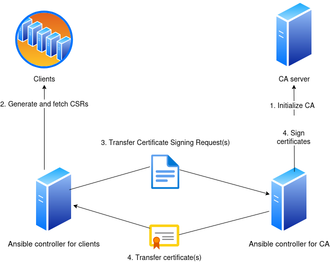

## Ansible role | certificate authority

This repository contains Ansible roles and playbooks for Ansible managed Certificate Authority and for generating and signing Certificate Signing Requests.

It allows seperation of CA management to a different Ansible controller, but alternatively clients and CA can be managed from a signle controller.

## Usage

The usage flow of the below picture shows an example when CA and clients are not managed from the same Ansible controller.



Note that transferring CSRs and certificates between controllers is not handled by plays in this repository as you may not want network connectivity between the CA and clients.

Check variables section below for necessary variable definitions.

### Separated controller

Playbooks starting with `ca-` are run on the CA's controller and playbooks starting with `clients-` are run on the client controller(s).

1. Initialize your CA: `ansible-playbook ... ca-init.yml`
2. Generate CSRs for clients: `ansible-playbook ... clients-generate-csr.yml`
3. Transfer CSR files from location defined in variable `csrs_controller_path` to CA's controller path defined with the same variable.
4. Sign certificates with CA: `ansible-playbook ... ca-sign.yml`
5. Transfer files from location defined in variable `crts_controller_path` to client controller(s) path defined with the same variable.
6. Push signed certificates to clients: `ansible-playbook ... `

### Single controller

Playbook `all-single-controller.yml` does all the steps when same controller is used for everything.

### Forcing certificate renewal

```
# Single controllor
ansible-playbook ... all-single-controller.yml -e "ca_client_reinit=True"
# Separated controller
ansible-playbook ... clients-generate-csr.yml -e "ca_client_reinit=True"
```

```bash
# Single controllor
ansible-playbook --vault-id @prompt -i inventory/hosts all-single-controller.yml -e "ca_reinit=True"
# Separated controller
ansible-playbook ca-init.yml -e "ca_reinit=True"
```

Note that these also renew private keys.


## Variables

There are similar variables for CA and clients and some common variables. All variables can be found in roles' defaults.

### CA's variables

```yaml
# Base directory path for CA's certificate and key
# Directory is created if it doesn't exist, but not recursively
ca_base_path: '/opt/ansible_ca'
# Owner for the base directory
ca_base_path_owner: root
# Group for the base directory
ca_base_path_group: root
# Mode for the base directory
ca_base_path_mode: '750'

ca:
# How long signed certs are valid
  certs_not_after: "+365d"
  key:
# CA private key path
    path: "{{ ca_base_path }}/ca-certificate.key" # Path
# Password for the private key - define vault_ca_key_pass in your ansible vault
    passphrase: "{{ vault_ca_key_pass }}"
# Key type
    type: "ECC"
# Key size with RSA/DSA
    size: "4096"
# Key format - check openssl_privatekey module documentation
    format: "auto_ignore"
# Curve for ECC keys
    curve: "secp384r1"
# Force key renewal whe variable ca_reinit is true
    force: "{{ ca_reinit }}"
  csr:
# Common name
    common_name: 'Ansible CA'
  crt:
# CA certificate path
    path: "{{ ca_base_path }}/ca-certificate.crt"
# CA certificate validity time
    not_after: "+3650d"

# Re-initialize CA (new key and certificate)
ca_reinit: false
```

### Clients' variables

Clients' variables pretty much same as for CA.

```yaml
ca_client_base_path: '/opt/ansible_ca'
ca_client_base_path_owner: root
ca_client_base_path_group: root
ca_client_base_path_mode: '750'

ca_client:
  key:
    path: "{{ ca_client_base_path }}/{{ inventory_hostname }}.key"
    type: "ECC"
    size: "4096" # RSA / DSA
    format: "auto_ignore"
    curve: "secp384r1" # ECC
    force: "{{ ca_client_reinit }}"
  csr:
    path: "{{ ca_client_base_path }}/{{ inventory_hostname }}.csr"
    common_name: "{{ inventory_hostname }}"
    subject_alt_name:
       - 'DNS:test.example.local'
  crt:
    path: "{{ ca_client_base_path }}/{{ inventory_hostname }}.crt"

ca_client_base_path: '/opt/ca_client'
ca_client_base_path_owner: root
ca_client_base_path_group: root
ca_client_base_path_mode: '750'

ca_client_reinit: false
```

When certificates with same specifications are wanted for all the clients you can have only one `ca_client` variable set for all clients. 
Then you can just do some own variables to define SANs and Common Name for each client.

For example:

* In host_vars:
```yaml
# host_vars
sans:
  - 'IP:1.2.3.4'
common_name: this.client.local
```

* In group_vars/all

```yaml
ca_client:
...
  csr:
    ...
    common_name: "{{ common_name}}"
    subject_alt_name: "{{ sans }}"
...
```


### Common variables

```yaml
csrs_controller_path: /tmp/csrs
crts_controller_path: /tmp/crts
```

